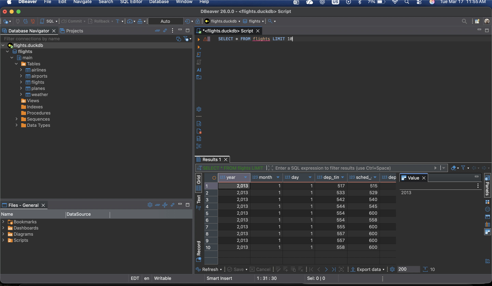
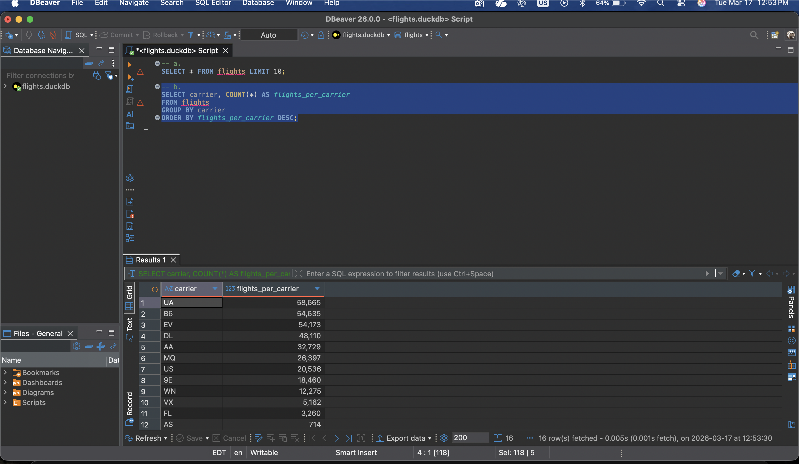
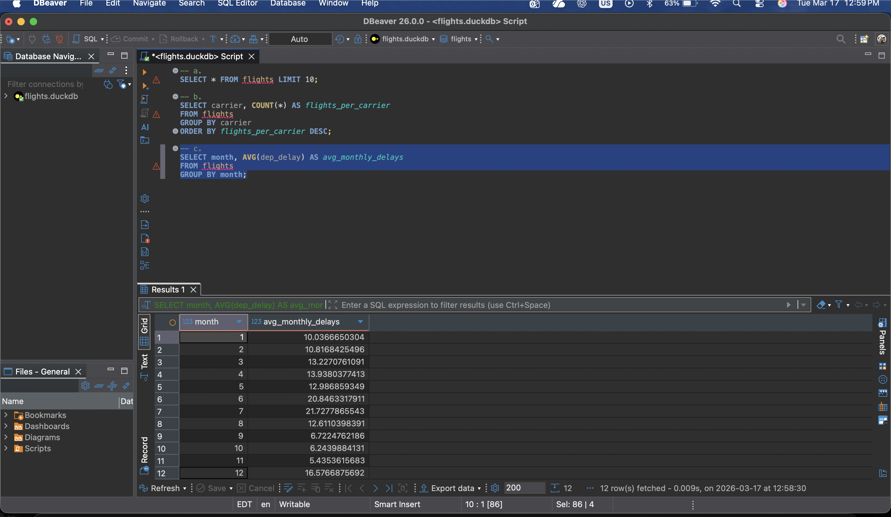

## Part 1:

```{R}
library(DBI)
library(duckdb)
library(nycflights13)
library(dplyr)

download.file(
  "https://data-science-master.github.io/lectures/data/flights.duckdb",
  destfile = "flights.duckdb",
  mode = "wb"
)
```

### a. 

```{R}
dbcon <- dbConnect(duckdb::duckdb(), dbdir = "flights.duckdb")
dbIsValid(dbcon)

dbGetQuery(dbcon, "SELECT * FROM flights LIMIT 10")
```

### b.

```{R}
dbGetQuery(dbcon, "SELECT COUNT(*) FROM flights")
dbGetQuery(dbcon, "SELECT carrier, COUNT(*) FROM flights GROUP BY carrier")
```

### c.

```{R}
dbGetQuery(dbcon, "SELECT AVG(dep_delay) FROM flights")
```

### d.

```{R}
dbGetQuery(dbcon, "
SELECT dest, COUNT(*) 
AS dest_count
FROM flights 
GROUP BY dest
ORDER BY dest_count DESC 
LIMIT 5")
```

### e.

```{R}
dbGetQuery(dbcon, "
SELECT carrier, AVG(arr_delay)
AS carrier_delays
FROM flights 
GROUP BY carrier
ORDER BY carrier_delays DESC ")
```

# NB:

Needed to add this at the bottom of my file, so that I wouldn't get an error when rendering my file for each commit. It wouldn't let me render without disconnecting.

```{R}
dbDisconnect(dbcon)
```

## Part 2:

### a.



### b.



### c.


